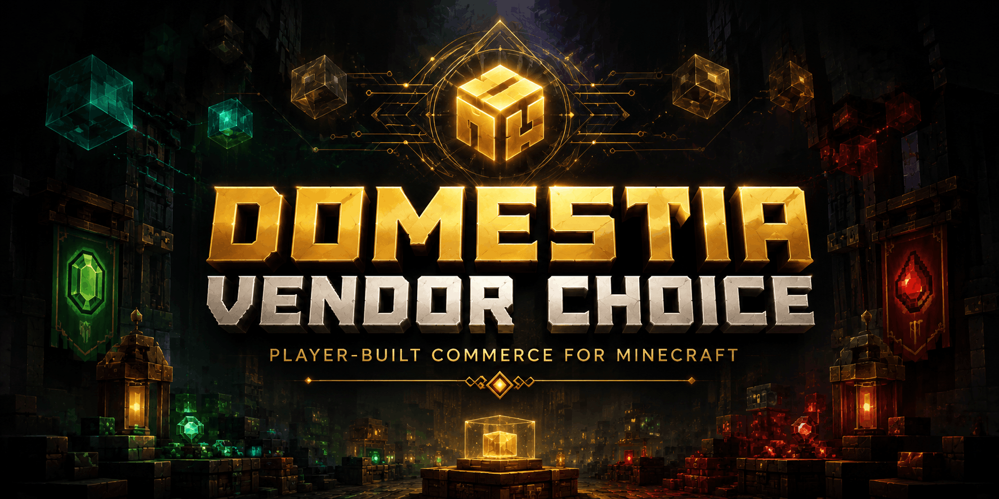

<h1 align="center">Domestia Vendor Choice</h1>

  

<h3 align="center">
  
  
  
</h3>

  

## About

**Domestia Vendor Choice** is a Fabric mod for Minecraft focused on player-to-player economy.

It adds protected commercial infrastructure for multiplayer survival servers: vending machines, private storage, owner-aware item logistics, player-written Vendor notes, holographic shop displays, and Vendor Scrap-based survival progression.

The mod is designed for players who want to build shops, manage stock, collect payments, and automate trading systems while preserving ownership and controlled access.

## Core Features

- Owner-aware Vendor blocks.
- Player-operated vending machines.
- Protected commercial storage.
- Private logistics for shop infrastructure.
- Protected player-written Vendor notes for shop labels, notices, and public information.
- Configurable holographic displays for shop signs, item previews, and public information.
- Purchase-triggered redstone transaction pulse.
- Vanilla-compatible interfaces and survival-oriented crafting.
- Vendor Scrap progression for protected Vendor infrastructure recipes.
- PBR-oriented block textures with normal and specular maps.

## Main Blocks

Domestia Vendor Choice currently includes:

- **Vendor Machine** — a player-owned vending machine for direct item exchange.
- **Vendor Safe** — protected private storage for shop supplies, revenue, and logistics.
- **Vendor Hopper** — owner-aware item logistics for Vendor infrastructure and intentional container connections.
- **Vendor Note** — an owner-protected note display for public read-only shop information and player-written notices.
* **Vendor Holo Display** — an owner-protected holographic display for billboards, shop signs, and item previews.

Detailed behavior, layouts, recipes, and access rules are documented in the project wiki.

## Core Resource

- **Vendor Scrap** — a crafting ingredient recovered from metal ore and used as the progression key for protected Vendor infrastructure recipes.

## Documentation

Full documentation is available in the GitHub Wiki:

[Domestia Vendor Choice Wiki](https://github.com/domestia-mods/domestia-vendor-choice/wiki)

Useful starting pages:

- [Creating a Basic Shop](https://github.com/domestia-mods/domestia-vendor-choice/wiki/Creating-a-Basic-Shop)
- [Automatic Restock and Payment Collection](https://github.com/domestia-mods/domestia-vendor-choice/wiki/Automatic-Restock-and-Payment-Collection)
- [Protected Logistics Rules](https://github.com/domestia-mods/domestia-vendor-choice/wiki/Protected-Logistics-Rules)
- [Ownership and Access Rules](https://github.com/domestia-mods/domestia-vendor-choice/wiki/Ownership-and-Access-Rules)

## Releases

Downloads and release notes are available here:

[GitHub Releases](https://github.com/domestia-mods/domestia-vendor-choice/releases)

For exact version changes, see:

[CHANGELOG.md](CHANGELOG.md)

## Requirements

- Minecraft: 1.21.x
- Fabric Loader
- Fabric API

## Status

Released.

This mod is released and playable, but it is still being tested and balanced on the Domestia server. Recipes, block behavior, and documentation may continue to change as gameplay balance is refined.

## Support

If you like this project, you can support development here:

  

## License

See [LICENSE](LICENSE).
